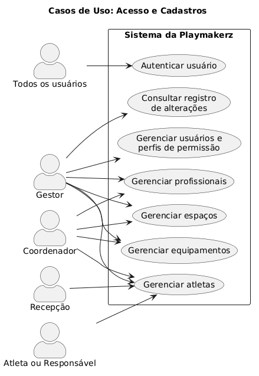
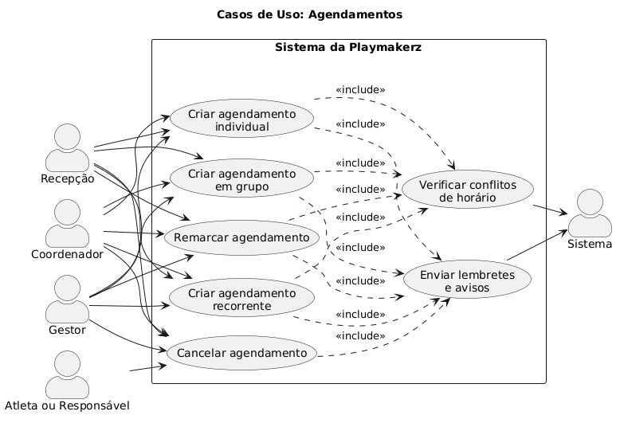
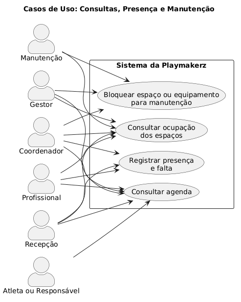

## 1 Objetivo

    Este documento descreve os casos de uso do sistema de gestão esportiva da Playmakerz, centro de treinamento de alta performance localizado na Barra da Tijuca (RJ). Ele detalha como cada tipo de usuário interage com o sistema para organizar atendimentos, profissionais, espaços e equipamentos, evitando conflitos de horário e protegendo os dados pessoais, principalmente os de crianças e adolescentes.  O documento cobre as funcionalidades previstas no escopo inicial do projeto (documento de Pesquisa): cadastros, agenda de atendimentos, verificação de conflitos, agendamentos individuais, em grupo e recorrentes, controle de presença, faltas e cancelamentos, bloqueio de recursos em manutenção, perfis de permissão, lembretes e consulta de ocupação.

---

## 2. Atores

| Ator | Tipo | Descrição |
|------|------|-----------|
| **Gestor** | Principal | Administra a academia, os usuários e as permissões, e acompanha a operação. |
| **Recepção** | Principal | Organiza os horários, cria e altera agendamentos e atende atletas e responsáveis. |
| **Coordenador** | Principal | Supervisiona treinadores, agendas e recursos. |
| **Profissional** | Principal | Treinador ou outro profissional que consulta sua agenda e registra presença. |
| **Manutenção** | Principal | Funcionário que bloqueia e libera espaços e equipamentos. |
| **Atleta** | Principal | Consulta seus próprios agendamentos e dados. |
| **Responsável** | Principal | Faz o mesmo que o atleta, em nome do menor de idade. |
| **Sistema (temporizador)** | Secundário | Dispara lembretes e avisos automáticos nos horários definidos. |

---

## 3. Especificação dos casos de uso

### Autenticar usuário

| Campo | Descrição |
|-------|-----------|
| **Descrição** | Permite que um usuário cadastrado acesse o sistema com sua conta individual. |
| **Atores** | Todos os usuários. |
| **Pré-condições** | O usuário possui conta ativa. |
| **Pós-condições** | O usuário é autenticado e vê apenas as funções do seu perfil. |
| **Regras de negócio** | Cada usuário possui conta individual, sem compartilhamento de credenciais. Cada perfil enxerga apenas as informações relacionadas à sua função. |

**Fluxo principal**
1. O usuário acessa a tela de login.
2. O usuário informa suas credenciais.
3. O sistema valida as credenciais.
4. O sistema identifica o perfil do usuário e abre a página inicial com as funções permitidas.

**Fluxos alternativos**
- **Esqueci a senha:** no passo 2, o usuário solicita a redefinição. O sistema envia as instruções para o contato cadastrado.

**Fluxos de exceção**
- **Credenciais inválidas:** o sistema exibe mensagem genérica e permite nova tentativa.
- **Conta inativa ou bloqueada:** o sistema informa que o acesso não está disponível e orienta a procurar a recepção.
- **Tentativas excessivas:** o sistema bloqueia temporariamente novas tentativas e registra o evento.

---

### Gerenciar usuários e perfis de permissão

| Campo | Descrição |
|-------|-----------|
| **Descrição** | Permite criar, editar, inativar usuários e definir o perfil de permissão de cada um. |
| **Atores** | Gestor. |
| **Pré-condições** | Gestor autenticado no sistema. |
| **Pós-condições** | Usuário criado ou alterado com o perfil correto; alteração registrada. |
| **Regras de negócio** | Cada usuário possui conta individual. Alterações importantes são registradas com usuário, data/hora e o que foi alterado. Contas não são excluídas, e sim inativadas, para preservar o histórico. |

**Fluxo principal**
1. O gestor acessa "Usuários".
2. O gestor seleciona "Novo usuário" e informa nome, contato e perfil (Gestor, Recepção, Coordenador, Profissional, Manutenção, Atleta ou Responsável).
3. O sistema valida os dados e cria a conta individual.
4. O sistema envia ao usuário o primeiro acesso.
5. O sistema registra a operação no registro de alterações.

**Fluxos alternativos**
- **Alterar perfil:** o gestor seleciona um usuário existente e altera o perfil. As novas permissões valem no próximo acesso.
- **Inativar usuário:** o gestor inativa a conta. O sistema impede novos acessos e mantém o histórico.

**Fluxos de exceção**
- **Contato já cadastrado:** o sistema informa a duplicidade e não cria a conta.
- **Último gestor ativo:** o sistema impede a inativação ou a troca de perfil do último gestor.

---

### Gerenciar atletas

| Campo | Descrição |
|-------|-----------|
| **Descrição** | Permite cadastrar, consultar, editar e inativar atletas, incluindo o vínculo com responsáveis quando o atleta for menor de idade. |
| **Atores** | Gestor, Recepção, Coordenador. Atleta e Responsável, com visão restrita (consulta e atualização de dados de contato). |
| **Pré-condições** | Usuário autenticado com permissão. |
| **Pós-condições** | Cadastro criado ou alterado e registrado. |
| **Regras de negócio** | Todo atleta menor de 18 anos deve ter pelo menos um responsável vinculado. Somente os dados realmente necessários são coletados, com a finalidade informada; dados sensíveis, como os de saúde, ficam visíveis apenas a perfis autorizados. Atleta e responsável só acessam os dados do próprio atleta. Alterações são registradas. Atletas são inativados, não excluídos. |

**Fluxo principal**
1. O usuário acessa "Atletas" e seleciona "Novo atleta".
2. O usuário informa os dados mínimos necessários (nome, data de nascimento, contato).
3. O sistema verifica a idade. Se o atleta for menor de 18 anos, solicita o cadastro ou vínculo de responsável.
4. O usuário confirma.
5. O sistema valida, salva e registra a operação.

**Fluxos alternativos**
- **Editar ou atualizar dados:** o usuário localiza o atleta, altera os campos permitidos ao seu perfil e salva. Atleta e responsável só editam os dados de contato do próprio atleta.
- **Inativar atleta:** o usuário inativa o cadastro. O sistema mantém o histórico e impede novos agendamentos.
- **Consultar dados sensíveis:** somente perfis autorizados visualizam esses campos.

**Fluxos de exceção**
- **Atleta menor sem responsável:** o sistema impede salvar o cadastro.
- **Atleta possivelmente duplicado:** o sistema alerta e pede confirmação antes de salvar.
- **Perfil sem permissão:** o sistema nega o acesso ao campo ou à operação.

---

### Gerenciar profissionais

| Campo | Descrição |
|-------|-----------|
| **Descrição** | Permite cadastrar e manter treinadores e outros profissionais, com sua função e disponibilidade de atendimento. |
| **Atores** | Gestor, Coordenador. |
| **Pré-condições** | Usuário autenticado com permissão. |
| **Pós-condições** | Profissional cadastrado ou alterado e registrado. |
| **Regras de negócio** | Um profissional não pode participar de dois agendamentos com horários sobrepostos. Somente os dados necessários são coletados. Alterações são registradas. Profissionais são inativados, não excluídos. |

**Fluxo principal**
1. O usuário acessa "Profissionais" e seleciona "Novo profissional".
2. O usuário informa nome, contato, função ou especialidade e dias e horários de disponibilidade.
3. O sistema valida e salva.
4. O sistema registra a operação.

**Fluxos alternativos**
- **Editar disponibilidade:** o sistema verifica se há agendamentos futuros fora do novo horário e lista os afetados para o usuário remarcar (Remarcar agendamento).
- **Inativar profissional:** o sistema exige que os agendamentos futuros sejam remarcados ou cancelados antes.

**Fluxos de exceção**
- **Campos obrigatórios ausentes:** o sistema destaca os campos e não salva.

---

### Gerenciar espaços

| Campo | Descrição |
|-------|-----------|
| **Descrição** | Permite cadastrar e manter os espaços de treino (ex.: quadras, salas, áreas de musculação) com nome, tipo e capacidade. |
| **Atores** | Gestor, Coordenador. |
| **Pré-condições** | Usuário autenticado com permissão. |
| **Pós-condições** | Espaço cadastrado ou alterado e registrado. |
| **Regras de negócio** | Um espaço bloqueado para manutenção não pode ser agendado no período do bloqueio. Em agendamentos em grupo, o número de atletas não pode exceder a capacidade do espaço. Alterações são registradas. Espaços são inativados, não excluídos. |

**Fluxo principal**
1. O usuário acessa "Espaços" e seleciona "Novo espaço".
2. O usuário informa nome, tipo, capacidade máxima e horário de funcionamento.
3. O sistema valida e salva.
4. O sistema registra a operação.

**Fluxos alternativos**
- **Editar capacidade:** se houver agendamentos futuros acima da nova capacidade, o sistema os lista para ajuste.
- **Inativar espaço:** o sistema exige tratar os agendamentos futuros antes de inativar.

**Fluxos de exceção**
- **Nome de espaço duplicado:** o sistema não permite salvar.

---

### Gerenciar equipamentos

| Campo | Descrição |
|-------|-----------|
| **Descrição** | Permite cadastrar e manter os equipamentos que podem ser reservados junto aos atendimentos. |
| **Atores** | Gestor, Coordenador. |
| **Pré-condições** | Usuário autenticado com permissão. |
| **Pós-condições** | Equipamento cadastrado ou alterado e registrado. |
| **Regras de negócio** | Um equipamento não pode participar de dois agendamentos sobrepostos além da quantidade disponível. Um equipamento bloqueado para manutenção não pode ser agendado no período do bloqueio. Alterações são registradas. Equipamentos são inativados, não excluídos. |

**Fluxo principal**
1. O usuário acessa "Equipamentos" e seleciona "Novo equipamento".
2. O usuário informa nome, categoria, quantidade e, opcionalmente, o espaço onde fica.
3. O sistema valida e salva.
4. O sistema registra a operação.

**Fluxos alternativos**
- **Editar quantidade:** o sistema verifica se há agendamentos futuros que dependem da quantidade anterior.
- **Inativar equipamento:** o sistema exige tratar os agendamentos futuros antes.

**Fluxos de exceção**
- **Quantidade inválida:** o sistema exige um valor maior que zero.

---

### Criar agendamento individual

| Campo | Descrição |
|-------|-----------|
| **Descrição** | Cria um atendimento único para um atleta, reunindo profissional, espaço e equipamento no mesmo agendamento. É a funcionalidade central da Gerência de Agendamentos (5W2H, versão 2.0). |
| **Atores** | Recepção, Coordenador, Gestor. Sistema (secundário). |
| **Pré-condições** | Usuário autenticado. Atleta, profissional, espaço e equipamento (se for usado) cadastrados e ativos. |
| **Pós-condições** | Agendamento confirmado e recursos reservados; lembretes programados; operação registrada. |
| **Regras de negócio** | O agendamento exige ao menos um atleta, um profissional, um espaço, data e horário de início e fim; o equipamento só é obrigatório quando a atividade o exigir. Nenhum atleta, profissional, espaço ou equipamento pode participar de dois agendamentos sobrepostos. Recursos bloqueados para manutenção não podem ser agendados. Atleta menor de idade deve ter responsável vinculado. A operação é registrada. |
| **Inclui** | Verificar conflitos de horário; Enviar lembretes e avisos. |

**Fluxo principal**
1. O usuário acessa a agenda e seleciona "Novo agendamento".
2. O usuário informa o atleta, o profissional, o espaço, o equipamento (opcional), a data e o horário de início e fim.
3. O sistema executa a verificação de conflitos de horário para atleta, profissional, espaço e equipamento.
4. O sistema não encontra conflitos e exibe o resumo do agendamento.
5. O usuário confirma.
6. O sistema salva o agendamento, reserva os recursos, programa os lembretes e registra a operação.
7. O sistema exibe a confirmação.

**Fluxos alternativos**
- **Sugerir horários livres:** no passo 2, o usuário informa apenas o período desejado e o sistema lista os horários em que todos os recursos estão livres. O usuário escolhe um deles.
- **Atleta menor de idade:** no passo 6, o sistema associa o responsável vinculado para o envio de lembretes e avisos.

**Fluxos de exceção**
- **Conflito encontrado (passo 3):** o sistema informa qual recurso está ocupado e em que horário, e sugere alternativas (outro horário, profissional, espaço ou equipamento). O usuário ajusta e retorna ao passo 3, ou cancela.
- **Recurso bloqueado ou inativo:** o sistema informa que o recurso está indisponível e impede a confirmação.
- **Horário fora do funcionamento ou da disponibilidade do profissional:** o sistema não permite salvar.
- **Falha ao salvar:** o sistema informa o erro e não reserva nenhum recurso.

---

### Criar agendamento em grupo

| Campo | Descrição |
|-------|-----------|
| **Descrição** | Cria um atendimento com vários atletas no mesmo horário, espaço e profissional. |
| **Atores** | Recepção, Coordenador, Gestor. Sistema (secundário). |
| **Pré-condições** | As mesmas de Criar agendamento individual. |
| **Pós-condições** | Agendamento em grupo confirmado; todos os participantes e recursos reservados. |
| **Regras de negócio** | Valem as regras do agendamento individual. Além disso, o número de atletas não pode exceder a capacidade do espaço. |
| **Inclui** | Verificar conflitos de horário; Enviar lembretes e avisos. |

**Fluxo principal**
1. O usuário seleciona "Novo agendamento em grupo".
2. O usuário informa nome ou identificação do grupo, profissional, espaço, equipamento (opcional), data e horário.
3. O usuário adiciona os atletas participantes.
4. O sistema verifica a capacidade do espaço e os conflitos de horário de todos os participantes e recursos.
5. O usuário confirma o resumo.
6. O sistema salva, reserva os recursos, programa os lembretes e registra a operação.

**Fluxos alternativos**
- **Adicionar ou remover participante depois de criado:** o sistema repete a verificação de capacidade e de conflito para o participante incluído.
- **Conflito com apenas alguns atletas:** o usuário pode remover os atletas com conflito e confirmar o restante.

**Fluxos de exceção**
- **Capacidade excedida:** o sistema impede a inclusão e informa o limite do espaço.
- **Conflito de profissional, espaço ou equipamento:** o sistema age como no fluxo de exceção de conflito do agendamento individual.

---

### Criar agendamento recorrente

| Campo | Descrição |
|-------|-----------|
| **Descrição** | Cria uma série de agendamentos que se repetem em dias e horários definidos, reduzindo o trabalho repetitivo da recepção. |
| **Atores** | Recepção, Coordenador, Gestor. Sistema (secundário). |
| **Pré-condições** | As mesmas de Criar agendamento individual ou Criar agendamento em grupo. |
| **Pós-condições** | Série de agendamentos criada, cada ocorrência com os recursos reservados. |
| **Regras de negócio** | Valem as regras do agendamento individual e do agendamento em grupo. Cada ocorrência é verificada individualmente contra conflitos; ocorrências com conflito não são criadas sem decisão do usuário. |
| **Inclui** | Verificar conflitos de horário; Enviar lembretes e avisos. |

**Fluxo principal**
1. O usuário inicia um novo agendamento (individual ou em grupo) e marca a opção "Recorrente".
2. O usuário define a regra de repetição: dias da semana, horário e data final (ou número de ocorrências).
3. O sistema gera as ocorrências e verifica os conflitos de horário de cada uma.
4. O sistema não encontra conflitos e exibe o resumo com as datas geradas.
5. O usuário confirma.
6. O sistema salva a série, reserva os recursos, programa os lembretes e registra a operação.

**Fluxos alternativos**
- **Conflito em algumas ocorrências:** o sistema lista as ocorrências com conflito. O usuário escolhe entre (a) ignorar essas datas, (b) alterar somente essas ocorrências ou (c) cancelar a criação.
- **Editar a série:** o usuário escolhe alterar "somente esta ocorrência", "esta e as seguintes" ou "toda a série", conforme descrito em Remarcar agendamento e Cancelar agendamento.

**Fluxos de exceção**
- **Período muito longo ou regra inválida:** o sistema pede a correção da regra.
- **Feriado ou dia de bloqueio:** o sistema trata como conflito e aplica o fluxo alternativo A1.

---

### Verificar conflitos de horário

| Campo | Descrição |
|-------|-----------|
| **Descrição** | Confere automaticamente se atleta(s), profissional, espaço e equipamento estão livres no período solicitado. É a principal proteção contra reservas duplicadas. |
| **Atores** | Sistema. |
| **Pré-condições** | Um agendamento (novo ou remarcado) foi submetido para validação. |
| **Pós-condições** | O sistema retorna "sem conflitos" ou a lista de conflitos detectados. |
| **Regras de negócio** | Nenhum recurso pode estar em dois agendamentos sobrepostos. Recursos bloqueados para manutenção são tratados como ocupados. Em grupos, a capacidade do espaço também é conferida. |

**Fluxo principal**
1. O sistema recebe os recursos e o período do agendamento.
2. Para cada recurso, o sistema busca agendamentos confirmados e bloqueios de manutenção que se sobreponham ao período (ignorando o próprio agendamento, no caso de remarcação).
3. O sistema não encontra sobreposições e retorna "sem conflitos".

**Fluxos alternativos**
- **Conflitos encontrados:** o sistema retorna, para cada conflito, o recurso, o período e o motivo (outro agendamento ou bloqueio), para que o caso de uso que o chamou informe o usuário.

**Fluxos de exceção**
- **Falha na consulta:** o sistema não confirma o agendamento e informa o erro, em vez de assumir que está livre.

---

### Remarcar agendamento

| Campo | Descrição |
|-------|-----------|
| **Descrição** | Altera data, horário, profissional, espaço, equipamento ou participantes de um agendamento existente. |
| **Atores** | Recepção, Coordenador, Gestor. Sistema (secundário). |
| **Pré-condições** | Agendamento existente e ainda não realizado. |
| **Pós-condições** | Agendamento atualizado, recursos anteriores liberados, participantes avisados. |
| **Regras de negócio** | Valem as regras de conflito e de bloqueio do agendamento individual. Em séries recorrentes, o usuário escolhe se a alteração vale para uma ocorrência, para as seguintes ou para toda a série. A operação é registrada. |
| **Inclui** | Verificar conflitos de horário; Enviar lembretes e avisos. |

**Fluxo principal**
1. O usuário localiza o agendamento em Consultar agenda e seleciona "Remarcar".
2. O usuário altera os campos desejados.
3. O sistema verifica os conflitos de horário, desconsiderando o próprio agendamento.
4. O usuário confirma.
5. O sistema atualiza o agendamento, libera os recursos antigos, reserva os novos, notifica os envolvidos e registra a operação.

**Fluxos alternativos**
- **Agendamento recorrente:** o usuário escolhe se a alteração vale para só esta ocorrência, esta e as seguintes ou toda a série.
- **Remarcação por motivo de manutenção:** ao ser acionado a partir de Bloquear espaço ou equipamento para manutenção, o sistema lista os agendamentos afetados para remarcação em lote.

**Fluxos de exceção**
- **Conflito no novo horário:** o sistema informa e sugere alternativas, como no fluxo de exceção de conflito do agendamento individual.
- **Agendamento já realizado ou cancelado:** o sistema não permite a alteração.

---

### Cancelar agendamento

| Campo | Descrição |
|-------|-----------|
| **Descrição** | Cancela um agendamento (ou uma ocorrência de uma série), libera os recursos e registra o cancelamento. |
| **Atores** | Recepção, Coordenador, Gestor. Atleta e Responsável, apenas para os próprios agendamentos. Sistema (secundário). |
| **Pré-condições** | Agendamento existente e ainda não realizado. |
| **Pós-condições** | Agendamento com status "cancelado"; recursos liberados; envolvidos avisados; motivo registrado. |
| **Regras de negócio** | Atleta e responsável só cancelam agendamentos do próprio atleta. O cancelamento é registrado com data, autor e motivo, quando informado. Em séries recorrentes, o usuário escolhe o alcance do cancelamento. |
| **Inclui** | Enviar lembretes e avisos. |

**Fluxo principal**
1. O usuário localiza o agendamento em Consultar agenda e seleciona "Cancelar".
2. O sistema solicita o motivo (opcional ou obrigatório, conforme a definição da academia).
3. O usuário confirma.
4. O sistema altera o status para "cancelado", libera os recursos e registra a data, quem cancelou e o motivo.
5. O sistema notifica o profissional e o atleta ou responsável.

**Fluxos alternativos**
- **Cancelar recorrência:** o usuário escolhe cancelar só esta ocorrência, esta e as seguintes ou toda a série.
- **Cancelamento solicitado por atleta ou responsável:** o sistema registra o cancelamento e notifica a recepção. Se a academia definir prazo mínimo de antecedência, o sistema aplica a regra conforme definido em Premissas e pontos em aberto.
- **Cancelamento em grupo:** o usuário cancela para todo o grupo ou remove apenas um participante.

**Fluxos de exceção**
- **Agendamento já realizado ou já cancelado:** o sistema não permite a operação.
- **Atleta ou responsável tenta cancelar agendamento de outro atleta:** o sistema nega o acesso.

---

### Consultar agenda

| Campo | Descrição |
|-------|-----------|
| **Descrição** | Exibe os agendamentos por dia, semana ou mês, com filtros, respeitando o perfil do usuário. |
| **Atores** | Gestor, Recepção, Coordenador, Profissional (visão restrita), Atleta e Responsável (visão restrita). |
| **Pré-condições** | Usuário autenticado. |
| **Pós-condições** | Nenhuma alteração de dados. |
| **Regras de negócio** | Atleta e responsável veem apenas os agendamentos do próprio atleta. O profissional vê apenas a própria agenda e os atletas dos seus atendimentos. Dados sensíveis ficam visíveis apenas a perfis autorizados. |

**Fluxo principal**
1. O usuário acessa "Agenda".
2. O sistema exibe os agendamentos que o perfil pode ver, no período atual.
3. O usuário aplica filtros (período, atleta, profissional, espaço, equipamento, status).
4. O sistema atualiza a lista ou o calendário.
5. O usuário abre um agendamento para ver os detalhes.

**Fluxos alternativos**
- **Visão do profissional:** o sistema mostra apenas os agendamentos em que ele é o profissional.
- **Visão do atleta ou responsável:** o sistema mostra apenas os agendamentos do próprio atleta, sem dados de outros atletas de grupos.

**Fluxos de exceção**
- **Nenhum agendamento no filtro:** o sistema informa que não há resultados.

---

### Registrar presença e falta

| Campo | Descrição |
|-------|-----------|
| **Descrição** | Registra se o atleta compareceu, faltou ou teve o atendimento cancelado. |
| **Atores** | Profissional, Recepção, Coordenador. |
| **Pré-condições** | Agendamento confirmado cujo horário já começou ou terminou. |
| **Pós-condições** | Agendamento com status "realizado" ou "falta"; histórico de presença atualizado. |
| **Regras de negócio** | O profissional só registra presença nos próprios atendimentos, salvo perfil de coordenação. Presenças e faltas são registradas com data, autor e motivo, quando informado. Correções mantêm o valor anterior no histórico. |

**Fluxo principal**
1. O usuário abre o agendamento do dia em Consultar agenda.
2. O usuário marca a presença de cada atleta como "presente" ou "falta".
3. O sistema salva o registro com data/hora e usuário responsável.
4. O sistema atualiza o status do agendamento.

**Fluxos alternativos**
- **Falta justificada:** o usuário registra a falta com o motivo informado.
- **Correção de registro:** um usuário autorizado altera o registro e o sistema guarda o valor anterior no histórico.
- **Grupo:** o usuário marca a presença individualmente para cada participante.

**Fluxos de exceção**
- **Agendamento futuro:** o sistema impede registrar presença antes do horário de início.
- **Profissional tenta registrar em atendimento de outro profissional:** o sistema nega o acesso, salvo se o perfil tiver permissão de coordenação.

---

### Bloquear espaço ou equipamento para manutenção

| Campo | Descrição |
|-------|-----------|
| **Descrição** | Torna um espaço ou equipamento indisponível por um período, impedindo novos agendamentos e alertando os já existentes. |
| **Atores** | Manutenção, Coordenador, Gestor. Sistema (secundário). |
| **Pré-condições** | Usuário autenticado com permissão. Espaço ou equipamento cadastrado. |
| **Pós-condições** | Bloqueio ativo no período; agendamentos afetados sinalizados. |
| **Regras de negócio** | Espaços e equipamentos bloqueados não podem ser agendados no período do bloqueio. O bloqueio e sua liberação são registrados. |
| **Estende-se para** | Remarcar agendamento e Enviar lembretes e avisos, quando houver agendamentos afetados. |

**Fluxo principal**
1. O usuário acessa "Manutenção" e seleciona "Novo bloqueio".
2. O usuário escolhe o espaço ou equipamento, o período (início e fim) e o motivo.
3. O sistema verifica se há agendamentos no período.
4. O sistema não encontra agendamentos, cria o bloqueio e registra a operação.

**Fluxos alternativos**
- **Existem agendamentos no período (passo 3):** o sistema lista os agendamentos afetados. O usuário confirma o bloqueio e o sistema encaminha os agendamentos para remarcação ou cancelamento (Remarcar agendamento ou Cancelar agendamento) e notifica os envolvidos (Enviar lembretes e avisos).
- **Encerrar ou reduzir o bloqueio:** o usuário libera o recurso antes do fim previsto e o sistema o disponibiliza novamente na agenda.

**Fluxos de exceção**
- **Período inválido (fim antes do início):** o sistema pede a correção.
- **Bloqueio sobreposto a outro bloqueio do mesmo recurso:** o sistema informa e sugere unir ou ajustar os períodos.

---

### Consultar ocupação dos espaços

| Campo | Descrição |
|-------|-----------|
| **Descrição** | Mostra, por espaço e período, quais horários estão ocupados, livres ou bloqueados. |
| **Atores** | Gestor, Recepção, Coordenador, Profissional, Manutenção. |
| **Pré-condições** | Usuário autenticado com permissão. |
| **Pós-condições** | Nenhuma alteração de dados. |
| **Regras de negócio** | Horários bloqueados para manutenção aparecem como indisponíveis. Cada perfil vê apenas o nível de detalhe permitido a ele. |

**Fluxo principal**
1. O usuário acessa "Ocupação dos espaços".
2. O usuário escolhe o período e, opcionalmente, os espaços.
3. O sistema exibe o mapa de ocupação, distinguindo horários livres, ocupados e bloqueados.
4. O usuário pode abrir um horário ocupado para ver o agendamento correspondente, conforme as permissões do perfil.

**Fluxos alternativos**
- **Encontrar horário livre:** a partir de um horário livre, o usuário pode iniciar um agendamento individual, se tiver permissão para isso.
- **Visão da manutenção:** o perfil mostra apenas ocupação e bloqueios, sem dados de atletas.

**Fluxos de exceção**
- **Nenhum espaço cadastrado:** o sistema informa que não há dados a exibir.

---

### Enviar lembretes e avisos

| Campo | Descrição |
|-------|-----------|
| **Descrição** | Envia automaticamente lembretes de atendimento e avisos de criação, remarcação e cancelamento aos envolvidos. |
| **Atores** | Sistema (principal). Profissional, Atleta e Responsável (destinatários). |
| **Pré-condições** | Agendamento criado, alterado ou cancelado, ou horário de lembrete programado. Destinatário com contato válido. |
| **Pós-condições** | Mensagem enviada e envio registrado. |
| **Regras de negócio** | Quando o atleta for menor de idade, os avisos são enviados ao responsável. As mensagens contêm apenas os dados necessários. Cada envio é registrado. |

**Fluxo principal**
1. O sistema identifica um evento que exige aviso (agendamento criado, alterado, cancelado ou horário de lembrete atingido).
2. O sistema determina os destinatários: profissional e atleta; ou responsável, se o atleta for menor de idade.
3. O sistema monta a mensagem com o mínimo de dados necessário (data, horário, local e profissional).
4. O sistema envia a mensagem pelo canal cadastrado.
5. O sistema registra o envio.

**Fluxos alternativos**
- **Lembrete antes do atendimento:** o sistema envia o lembrete com a antecedência configurada (ex.: 24 h antes).
- **Aviso de bloqueio de recurso:** quando acionado a partir de Bloquear espaço ou equipamento para manutenção, o sistema avisa os envolvidos sobre a necessidade de remarcação.

**Fluxos de exceção**
- **Contato inválido ou envio com falha:** o sistema registra a falha, tenta novamente conforme a política de reenvio e, se persistir, sinaliza à recepção para contato manual.
- **Destinatário sem autorização de contato:** o sistema não envia e registra o motivo.

---

### Consultar registro de alterações

| Campo | Descrição |
|-------|-----------|
| **Descrição** | Permite consultar o histórico de alterações importantes do sistema, apoiando a rastreabilidade exigida pela LGPD. |
| **Atores** | Gestor. |
| **Pré-condições** | Gestor autenticado. |
| **Pós-condições** | Nenhuma alteração de dados. |
| **Regras de negócio** | Alterações importantes são registradas com usuário, data/hora e o que foi alterado. Somente o gestor acessa esse registro. |

**Fluxo principal**
1. O gestor acessa "Registro de alterações".
2. O gestor filtra por período, usuário, tipo de operação ou entidade (atleta, agendamento, permissão etc.).
3. O sistema exibe a lista com data/hora, usuário, operação e o que foi alterado.

**Fluxos alternativos**
- **Investigar acesso indevido:** o gestor filtra por atleta ou por usuário para verificar quem consultou ou alterou dados sensíveis.

**Fluxos de exceção**
- **Usuário sem permissão:** o sistema nega o acesso.

---

## 4. Diagrama de Casos de Uso

Os diagramas abaixo mostram os atores e os casos de uso descritos na seção 3. Foram divididos em três para ficarem fáceis de ler. Neles, "Atleta ou Responsável" representa os dois atores, que têm a mesma visão restrita.

### 4.1 Acesso e Cadastros

Fonte: [`casos_de_uso_cadastros.puml`](../assets/Casos_de_Uso/casos_de_uso_cadastros.puml)

### 4.2 Agendamentos

Criar (individual, em grupo e recorrente) e remarcar agendamento incluem (`<<include>>`) a verificação de conflitos de horário e o envio de lembretes e avisos, como indicado no campo "Inclui" de cada caso de uso. Cancelar agendamento inclui o envio de lembretes e avisos.

Fonte: [`casos_de_uso_agendamentos.puml`](../assets/Casos_de_Uso/casos_de_uso_agendamentos.puml)

### 4.3 Consultas, Presença e Manutenção

Quando existem agendamentos no período de um bloqueio, "Bloquear espaço ou equipamento para manutenção" leva a Remarcar agendamento e a Enviar lembretes e avisos, como descrito na especificação do caso de uso.

Fonte: [`casos_de_uso_consultas.puml`](../assets/Casos_de_Uso/casos_de_uso_consultas.puml)

| Versão | Data       | Autor(es)                | Revisor(es) | Resumo da alteração                       |
| ------ | ---------- | ------------------------ | ----------- | ----------------------------------------- |
| v0.1   | 30/09/2026 | Pedro Henrique MArques Loredo de Paula | pendente    | Criação do Diagrama de Classes de uso |