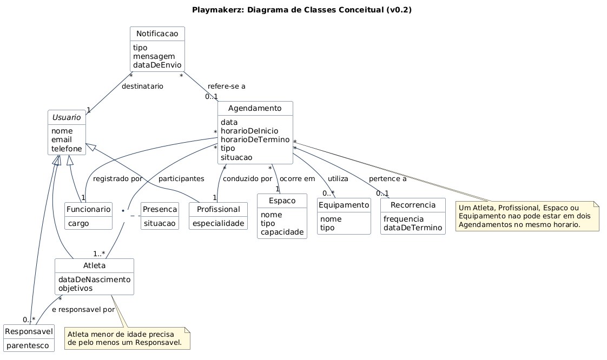

## Diagrama de Classes

### Objetivo

O Diagrama de Classes é uma representação visual das classes, seus atributos, métodos e os relacionamentos entre elas. Ele é fundamental para a modelagem orientada a objetos e serve como base para a implementação do sistema.

### 1) Diagrama de Classes Conceitual

#### 1.1 Finalidade

Representar conceitos do domínio, suas responsabilidades e relacionamentos, sem detalhes de implementação.

#### 1.2 Escopo

- Entidades de negócio;
- Objetos de valor;
- Regras de associação e cardinalidade;
- Generalizações relevantes.

 
Fonte: [`classes_conceitual.puml`](../assets/Diagrama_de_Classes/classes_conceitual.puml)

#### 1.3 Notação mínima

| Classe | Descrição curta | Atributos de domínio |
| ------ | --------------- | -------------------- |
| Usuario (abstrata) | Pessoa que acessa o sistema | nome, email, telefone |
| Atleta | Aluno atendido pela Playmakerz | dataDeNascimento, objetivos |
| Responsavel | Pai ou responsável de atleta menor de idade | parentesco |
| Profissional | Treinador ou profissional que conduz os atendimentos | especialidade |
| Funcionario | Recepção, coordenação, gestão ou manutenção | cargo |
| Espaco | Local de treino | nome, tipo, capacidade |
| Equipamento | Equipamento que pode ser reservado | nome, tipo |
| Agendamento | Atendimento com atletas, profissional, espaço e equipamentos | data, horarioDeInicio, horarioDeTermino, tipo, situacao |
| Recorrencia | Regra de repetição de agendamentos | frequencia, dataDeTermino |
| Presenca | Presença ou falta do atleta em um agendamento | situacao |
| Notificacao | Confirmação, lembrete ou aviso enviado a um usuário | tipo, mensagem, dataDeEnvio |

#### 1.4 Rastreabilidade

Os requisitos (RF) estão no [Levantamento de Requisitos](levreq.md) e os casos de uso estão em [Casos de Uso](casos_de_uso.md).
 
| Classe Conceitual | Requisito(s) | Caso(s) de Uso | Tela/Protótipo |
| ----------------- | ------------ | -------------- | -------------- |
| Usuario | RF01, RF02, RF15 | Autenticar usuário; Gerenciar usuários e perfis de permissão | Tela 1 |
| Atleta | RF02, RF04 | Gerenciar atletas; Criar agendamento individual; Consultar agenda | Tela 1, Tela 2 |
| Responsavel | RF02, RF04 | Gerenciar atletas; Consultar agenda | Tela 1 |
| Profissional | RF02, RF08 | Gerenciar profissionais; Registrar presença e falta; Consultar agenda | Tela 2 |
| Funcionario | RF02, RF03 | Gerenciar usuários e perfis de permissão; Criar agendamento individual | Tela 1 |
| Espaco | RF06, RF10, RF14 | Gerenciar espaços; Consultar ocupação dos espaços | Tela 2 |
| Equipamento | RF06, RF10 | Gerenciar equipamentos; Bloquear espaço ou equipamento para manutenção | Tela 2 |
| Agendamento | RF09, RF10, RF12, RF17 | Criar agendamento (individual, em grupo e recorrente); Remarcar agendamento; Cancelar agendamento | Tela 2 |
| Recorrencia | RF11 | Criar agendamento recorrente | Tela 2 |
| Presenca | RF12 | Registrar presença e falta | Tela 2 |
| Notificacao | RF13 | Enviar lembretes e avisos | não prototipado |

#### 1.5 Critérios de validação

- [x] Cada classe deve ter vínculo com ao menos um requisito/caso de uso;
- [x] Não incluir classes técnicas (ex.: repositório, controller);
- [x] Terminologia alinhada ao domínio do problema.

### 2) Transição para Diagrama de Classes de Especificação

#### 2.1 Objetivo

Refinar o modelo conceitual para uma estrutura orientada à implementação.

#### 2.2 Regras de refinamento

- Converter conceitos em classes de software quando aplicável;
- Definir tipos de atributos e visibilidade;
- Incluir operações principais;
- Aplicar estereótipos quando necessário (ex.: `<<entity>>`, `<<service>>`, `<<boundary>>`);
- Preservar rastreabilidade com requisitos e casos de uso.

#### 2.3 Itens esperados por classe

- **Nome da classe**;
- **Atributos** (`nome: tipo [visibilidade]`);
- **Métodos/operações** (`assinatura`);
- **Responsabilidade**;
- **Dependências e associações**;
- **Restrições/invariantes** (quando houver).

### 3) Diagrama de Classes de Especificação

#### 3.1 Conteúdo mínimo

- Classes de domínio e de apoio à aplicação;
- Interfaces relevantes;
- Associações, agregações/composições e heranças;
- Multiplicidades e navegabilidade;
- Operações alinhadas aos fluxos dos casos de uso.

#### 3.2 Rastreabilidade

| Classe de Especificação | Origem Conceitual | Requisito(s) | Caso(s) de Uso |
|---|---|---|---|
| `<ClasseSpec>` | `<ClasseConceitual>` | `RF-xx` | `UC-xx` |

#### 3.3 Critérios de qualidade

- Cobertura dos requisitos funcionais;
- Coesão alta e acoplamento controlado;
- Nomes consistentes com o domínio;
- Ausência de classes sem responsabilidade clara.

### 4) Estrutura de versionamento e revisão

| Versão | Data       | Autor(es)                | Revisor(es) | Resumo da alteração                       |
| ------ | ---------- | ------------------------ | ----------- | ----------------------------------------- |
| v0.1   | 29/09/2026 | Maria Eduarda Alves Cruz | pendente    | Criação do Diagrama de Classes Conceitual |

### 5) Entregáveis

- [x] Diagrama de Classes Conceitual (imagem + fonte);
- [ ] Diagrama de Classes de Especificação (imagem + fonte);
- [x] Tabelas de rastreabilidade preenchidas (conceitual);
- [ ] Registro de validação com equipe e stakeholders.