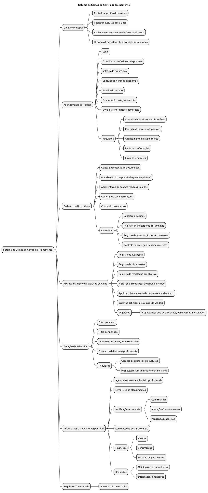
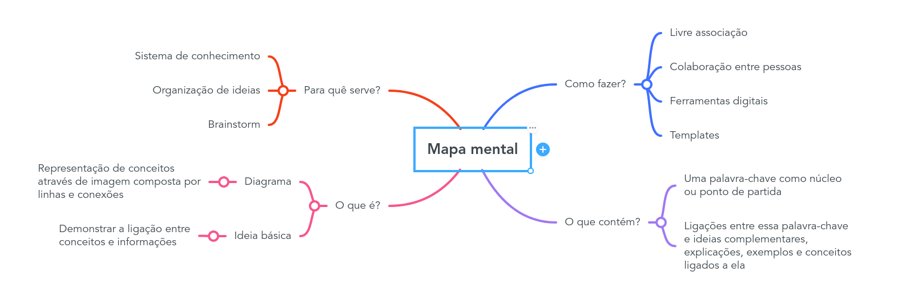

 
## Introdução
 

Mapa mental consiste em criar resumos cheios de símbolos, cores, setas e frases de efeito com o objetivo de organizar o conteúdo e facilitar associações entre as informações destacadas. Esse material é muito indicado para pessoas que têm facilidade de aprender de forma visual.

 
## Metodologia
 

Foi levantado um ponto importante sobre o app e, assim, foi produzido o mapa mental. O documento foi produzido utilizando a ferramenta...

 
## Mapa mental - Geral.
 
## Versão 1.0
 
### Mapa mental 1

 
 
### Mapa mental 2
 

 
## Conclusão
 

O mapa mental é uma ficha de estudos que ajuda a dar uma visão geral do tema, e ajuda a fixar os pontos mais importantes sobre o app.

 
## Referências
PLANTUML. PlantUML: ferramenta para criação de diagramas a partir de texto. Disponível em: https://plantuml.com/. Acesso em: 9 set. 2026.

PLANTUML. MindMap Diagram: documentação para criação de mapas mentais. Disponível em: https://plantuml.com/mindmap-diagram. Acesso em: 9 set. 2026.

BRITISH COUNCIL. Graphic organisers. Disponível em: https://www.teachingenglish.org.uk/professional-development/teachers/knowing-subject/graphic-organisers. Acesso em: 9 set. 2026.
 
## Versionamento
| Data | Versão | Descrição | Autor(es) |
| -- | -- | -- | -- |
| 08/09/2026 | 1.0 | Criação do documento em plantuml | Pedro Henrique |
| 09/09/2026 | 2.0 | Adicionado Mapa mental no arquivo md | Daniel Gusmão |
