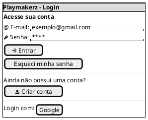
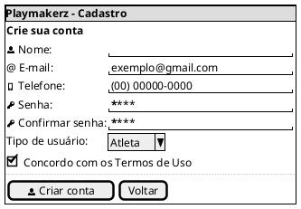
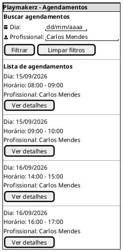

# Protótipo de Baixa Fidelidade — Playmakerz

## Tela 1 — Login e Cadastro

### Login

Observação: cada usuário deverá ter acesso somente às informações necessárias para sua função, visando proteger dados pessoais e sensíveis.

### Cadastro

Observação: para atletas menores de idade, deverá ser considerada a associação da conta a um pai ou responsável.

Observação: o cadastro e as permissões de determinados perfis, principalmente funcionários e profissionais, poderão depender de autorização da administração.

---

## Tela 2 — Informações de Agendamento

### Verificação do Agendamento

Antes da confirmação, o sistema deverá verificar se os elementos envolvidos no atendimento estão disponíveis durante o período selecionado.

Verificação: disponibilidade do atleta  
Verificação: disponibilidade do profissional  
Verificação: disponibilidade do espaço  
Verificação: disponibilidade dos equipamentos selecionados  
Verificação: existência de bloqueios por manutenção  
Mensagem: informar quando o agendamento estiver disponível  
Mensagem de conflito: informar quando algum atleta, profissional, espaço ou equipamento já estiver associado a outro agendamento no mesmo período ou estiver indisponível  

Botão: Confirmar agendamento

Observação: o sistema deverá impedir reservas duplicadas ou com conflito de horário.

Observação: após a confirmação, o agendamento deverá ficar disponível para consulta pelos usuários autorizados de acordo com seus respectivos perfis.

Observação: atletas e responsáveis deverão visualizar apenas os agendamentos relacionados a eles, enquanto profissionais deverão consultar sua própria agenda. Perfis administrativos poderão possuir acesso mais amplo conforme suas permissões.

Observação: o sistema deverá permitir posteriormente o acompanhamento do status do atendimento, incluindo presença, falta ou cancelamento, conforme previsto no escopo do projeto.

## Referências

> Material Design Color Tool. Disponível em:  https://material.io/resources/color/#!/?view.left=0&view.right=0

> PMI. Um guia do conhecimento em gerenciamento de projetos. Guia PMBOK® 5a. ed. EUA: Project Management Institute, 2013.

> Ferramenta Figma. Disponível em https://www.figma.com

## Autor(es)

| Data     | Versão | Descrição                            | Autor(es)                                                                            |
| -------- | ------- | -------------------------------------- | ------------------------------------------------------------------------------------ |
|01/09/26|1.0| Criação do documento|Marcos Martins|

